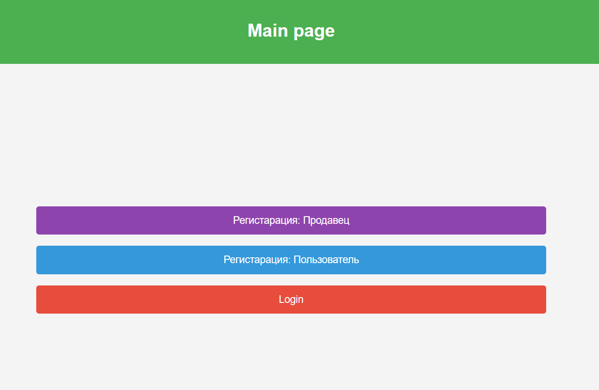
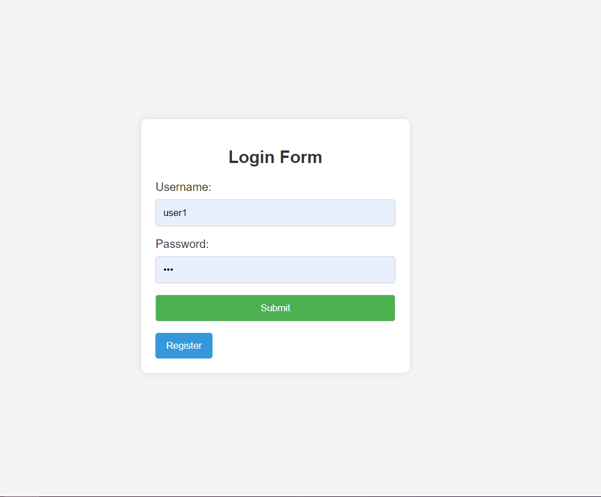
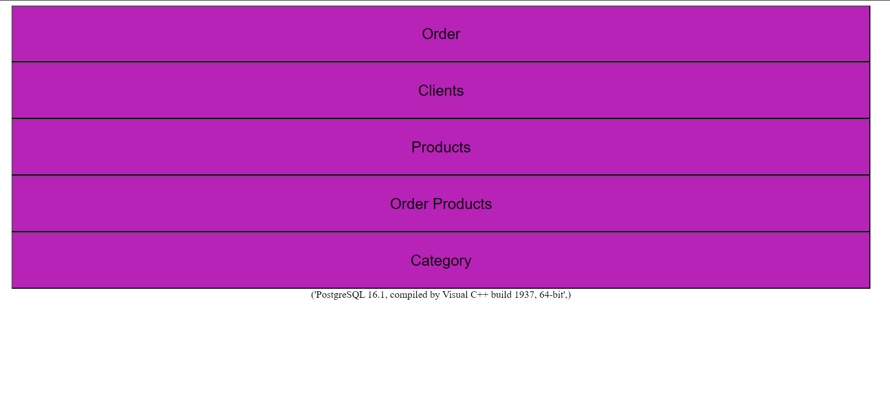

## Order Store

---

Магазин заказов Курсовой проект по курсу: Базы данных.
### Выполненные задания:
### 1.Таблица базы данных использующая связь many-to-many

-  В таблице «clients» хранится информация о клиентах;

- значение поля «client_phone» должно удовлетворять паттерну американского номера Пример 555-322-1337;

- в таблице «products» – информация об изделиях;

- в таблице «orders» – информация о заказах;

 - тип «order_status» обозначает набор значений (’Ожидается’, ’Отправленный’, ’Доставленный’);

- в таблице «order_products» – информация о связи продукта и номера заказа
### Запрос на создание таблице clients
```sql
CREATE TABLE clients (
	id SERIAL PRIMARY KEY,
	client_name VARCHAR, 
	lient_surname VARCHAR,
	client_phone VARCHAR,
	client_address VARCHAR
);
```
### Заполнение таблицы Clients
```sql
INSERT INTO clients (client_name, client_surname, client_phone, client_address) 2 VALUES 
	('DAN', 'Teylor', '555-123-4567', '123 Oak St'),
	('Ken', 'Swift', '555-987-6543', '456 Pine St'), 
	('Christopher', 'Davis', '555-234-5678', '789 Maple St'),
	('Jessica', 'Martinez', '555-876-5432', '101 Cedar St'), 
	('Brian', 'Jones', '555-345-6789', '202 Birch St')...
```

### Web интерфейс
Главная страница:

Форма регистрации:

Выбор таблицы для взаимодействия:


### Основные требования к курсовой
1. Валидация данных
-- Все таблицы приставлены в виде объектов Python при помощи Pydantic
```python
from pydantic import BaseModel,  validator

class Clients(BaseModel):
    id: int
    client_name: str
    client_surname: str
    client_phone: str
    client_addres: str

    @validator("client_phone")
    @classmethod
    def validate_phone(cls,value):
        numbers = list(map(str,value.split("-")))
        if len(numbers) != 3:
            raise ValueError("Phone Number is uncorrect")
        elif len(numbers[0]) != 3 or  len(numbers[1]) != 3 or  len(numbers[2]) != 4:
            raise ValueError("Phone Number is uncorrect")
        else:
            return value
```
2. Запросы на вставку, удаление и изменение данных
-- Подключение к базе данных, как и запросы писались с помощь библиотеки psycopg2, которая предоставляет возможность писать чистые sql запросы к базе данных
#### Вставка
```python
def add_new_user(user_name : str,user_email : str,user_password : str):
    conn, cur = get_connection()
    request = cur.mogrify("""INSERT INTO users 
                                    (user_name, user_password, user_email, user_permission)  
                                    VALUES (%s, %s, %s, 'пользователь')
                            RETURNING id""", 
                                    (user_name, user_password, user_email)
                                )
    cur.execute(request)
    response = cur.fetchall()
    conn.commit()  
    return response
```
#### Изменение
```python
def change_client(client: Clients):
    conn, cur = get_connection()
    request = cur.mogrify("""UPDATE clients
                        SET
                            client_name = %s,
                            client_surname = %s,
                            client_phone = %s,
                            client_address = %s
                        WHERE id = %s
                          """, (client.client_name, client.client_surname, client.client_phone, client.client_addres,client.id,))
    cur.execute(request)
    conn.commit()    
```
#### Удаление
```python
def delete_order_db(order_id: int):
    conn, cur = get_connection()
    request = cur.mogrify("""DELETE FROM order_products WHERE order_id = %s""", (order_id,)) 
    cur.execute(request)
    conn.commit() 
    request = cur.mogrify("""DELETE FROM orders WHERE id = %s""", (order_id,)) 
    cur.execute(request)
    conn.commit() 
```

Пример запроса:
```python
@router.post("/{user_id}", response_class=HTMLResponse)
async def edit_client(
    request: Request,
    user_id: int,
    username: str = Form(...),
    surname: str = Form(...),
    phone: str = Form(...),
    address: str = Form(...),
): 
    try:
        change_client(
            Clients(
                id=user_id,
                client_name=username,
                client_surname=surname,
                client_phone=phone,
                client_addres=address,
            )
        )
    except ValueError  as exc:
        print("LOG: POST REQUEST IS WORCK")
        return templates.TemplateResponse("exception_page.html", {"status": 200, "request": request, "data": exc})
    response = get_client(user_id)
    return templates.TemplateResponse("clients_page.html", {"status": 200,"request": request, "data": response})
```
